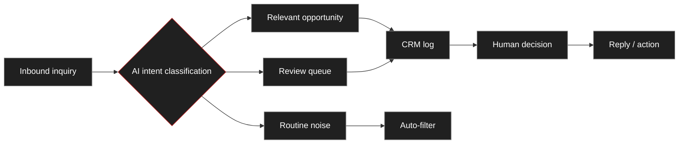

# VortexDeep — LinkedIn Posts

**Two channels:**
- **LI-MJS** = Maciek Szczęch personal profile → **post here first** (warm network, early engagement drives reach).
- **LI-VD** = VortexDeep company page → **mirror the same post 1–2 days later** (brand followers + archive).

**House rules (all posts):**
- Same body on both channels. On the LI-VD version, soften first-person **"I" → "we"** (see each draft's *LI-VD mirror note*).
- Only **Post 0** carries a link — put it in the **first comment**, not the post body. Posts **A / D / B / C / E carry no link**.
- **First hour:** reply to every comment. Watch **comments, not likes** — the post that draws the most replies points at your wedge.
- **Run order after Post 0:** A → D → B → C. **Post E** is a spare (drop in any time).

---

# ✅ POSTED

## 260626 · LI-MJS · MG Red Shift inbox case study

> Manual inbox sorting often looks like a small task.
> For a small business, it can still take attention away from the messages that really matter.
>
> A recent case was **MG Red Shift Switzerland**.
> Their website inquiries included customer questions, technical product questions, international business requests, and irrelevant messages.
> The goal was not to automate everything, but to make incoming messages easier to understand, prioritize, and review.
>
> At **VortexDeep**, we help small businesses turn repetitive operational tasks into practical AI-assisted workflows.
>
> In this case, the workflow identifies message intent, separates relevant cases from routine noise, routes inquiries into the right follow-up path, and keeps final decisions under human control.
>
> The result is a cleaner queue, better visibility, and less repetitive sorting work.
>
> If your business receives mixed website inquiries and too much time goes into sorting them, this is exactly the kind of workflow we can help structure.

**Attached diagram (Mermaid):**

---

## 260718 · LI-MJS · "VortexDeep is live" (Post 0, personal)

> After 20 years building and running processes, I've started something of my own: practical AI automation for small and mid-sized companies — built around one rule most of the hype ignores.
>
> You approve every step. Nothing is sent, paid, or filed on its own. Your data stays yours. Leave any month.
>
> The site has a 2-minute "Fit Check" — six short questions that give you an honest read on where your operations stand and what's actually worth automating first. Your result appears on screen straight away, with a recommendation you can act on. No sales call.
>
> If repetitive admin is quietly eating your team's week, try it — link in the comments. 👇
> And I'd genuinely value your thoughts on the site itself.

**First comment (posted immediately underneath):**

> The site: https://vortexdeep.ch — and the 2-minute Fit Check: https://vortexdeep.ch/check
> Would genuinely value your read.

*Publish notes: tagged @VortexDeep so it links · square Fit Check image attached · first comment added immediately · replied in the first hour.*

---

## 260719 · LI-VD · "VortexDeep is live" (Post 0, company page)

> VortexDeep is live.
> Practical AI automation for small and mid-sized companies in Switzerland — built around one rule most of the hype ignores: a person approves every step. Nothing is sent, paid, or filed on its own. Your data stays yours. Leave any month.
> Founded by Maciek Szczęch on 20 years of building and running processes. The automation takes repetitive admin off your team's week — not the judgement calls off your desk.
> Start with the 2-minute "Fit Check": six short questions for an honest read on where your operations stand and what's actually worth automating first. Your result appears on screen straight away, with a recommendation you can act on. No sales call.
> If repetitive admin is quietly eating your team's week, it's worth two minutes — link in the comments.

**First comment (posted immediately underneath):**

> The site: https://vortexdeep.ch — and the 2-minute Fit Check: https://vortexdeep.ch/check
> Would genuinely value your read.

---

# 🕓 QUEUE — NOT YET POSTED

*When you post one: change its `TODO` to a date (e.g. `260725 · LI-MJS`), then add the LI-VD mirror entry 1–2 days later using the mirror note.*

---

## TODO · LI-MJS · Post A — warm audience (engineering / technical / ops)

*Image: none (text-only is stronger). Link: none.*

> Most small firms I speak with don't have an "AI problem."
> They have a "too much of the week disappears into repetitive admin" problem.
>
> Inquiries to sort. Quotes to draft. Documents to file. The same handful of tasks, over and over — usually landing on your most experienced people, who should be doing the actual work.
>
> So the useful question isn't "how do we adopt AI." It's: which repetitive slice can we hand off — while every decision that matters still gets a human's eyes?
>
> Automating the sorting and drafting is easy. Automating the judgement is where things go wrong. So we don't. The machine prepares; a person approves; nothing goes out on its own.
>
> If you run a small technical or professional team — what's the one repetitive task you'd hand off first, if you could keep full control of the outcome?
>
> Genuinely curious. 👇

**LI-VD mirror note:** change opening to **"Most small firms *we* speak with…"**. Everything else already reads in the "we" voice — post as-is.

---

## TODO · LI-MJS · Post D — "Inbox this week" (signal vs noise)

*Image: none (text-only lands hardest). Link: none.*
*Angle: fresh — uses real inbox spam, distinct from the 26 June MG Red Shift case study, so it won't read as a repeat.*

> Two days. One small business inbox. Here's what actually arrived:
>
> — An email promising to make AI assistants recommend the business. (A real service, as it happens — the market's genuinely moving there.)
>
> — An email warning that "42% of your traffic" was being lost, fix available if you just reply "Interested." (A made-up number. Nobody can produce that from a glance at your site.)
>
> — And mixed in with those: three real customer enquiries.
>
> The hard part isn't answering any one of them. It's telling signal from noise, fast, before a real enquiry gets buried under the pitches.
>
> That sorting — reading what comes in, flagging what's real, setting the rest aside — is the quietest, most repetitive work in a small business. It's also exactly the kind of thing worth handing off: capture, sort, draft a reply for the ones that matter — with a person still deciding what's real and what actually gets sent.
>
> Not "AI runs your inbox." A human makes the call. The machine just makes sure the real enquiry doesn't drown.
>
> If you run a small team — how much of your week goes to separating the real messages from the noise?

**LI-VD mirror note:** this is a first-person observation ("*One small business inbox*"). On the company page, frame it as an observed/client inbox rather than "my inbox" — e.g. open with **"Two days in a small business inbox we looked at. Here's what actually arrived:"**. Rest unchanged.

---

## TODO · LI-MJS · Post B — the API-gap differentiator (API-first, human-gated)

*Image: optional simple "app A ✕ app B — no plug" diagram. Link: none.*

> A quiet reason automation "doesn't work" for a lot of Swiss SMEs — and what actually gets past it.
>
> Most automation connects software through APIs — the digital plug that lets two systems talk. When a system has a clean API, we use it. That's the fast, reliable path, and it runs most of what we build.
>
> But much of the software Swiss businesses actually live in has no open plug, or a gated, costly one. So the standard "connect app A to app B" approach hits a wall exactly where the pain is worst.
>
> Two ways past that wall: expensive certified middleware, or AI that operates the software the way a person would — with a human checking each step.
>
> We do both sides: clean APIs where they exist, interface-level reach where they don't. And in every case a person approves before anything is saved or sent — because one wrong entry in accounting isn't a rounding error, it's a problem.
>
> Less flashy than "fully autonomous." Also the part that actually holds up.
>
> If you've been told your systems "can't be automated because they don't talk to each other" — that's often not the end of the story. Just not the easy version of it.

**LI-VD mirror note:** already "we"-voiced — post as-is, no change.

---

## TODO · LI-MJS · Post C — the POV / trust post ("assistant, not autopilot")

*Image: none. Link: none.*

> An unpopular opinion for an automation company to hold:
>
> Some things should not be automated.
>
> The judgement calls. The ambiguous cases. The client who needs a human, not a workflow. The final sign-off on anything that touches money, law, or people.
>
> We build automation for the repetitive slice around those things — the reading, sorting, drafting, filing — so the people in your business have more room for the parts that genuinely need them.
>
> "Assistant, not autopilot" isn't a limitation we apologise for. It's the whole point.
>
> If an automation partner promises to run your business without you in the loop — ask them who's accountable when it's wrong.

**LI-VD mirror note:** already "we"-voiced — post as-is, no change.

---

## TODO · LI-MJS · Post E — "Real vs fake audit" (spare, pure-value)

*Image: none. Link: none. Publish any time as standalone value.*

> Every week now, small businesses get emails offering to "fix" their website or their AI visibility. Some are real. Most aren't. Five tells that it's noise:
>
> 1. A precise scare number it can't possibly know — "you're losing 42% of your traffic." No one can produce that from the outside. A real audit shows you where it looked and what it found.
> 2. The reply-gate — "just answer 'Interested' and I'll send the details / price list." A real service tells you something useful up front; it doesn't hold the findings hostage to a reply.
> 3. No specifics, just "issues" — vague "major problems" with no example. Real feedback names the actual page, the actual gap.
> 4. Leaked template seams — a stray "[25]" after a job title, a broken link, your domain pasted three times. Mass-mail, not a person who looked.
> 5. No accountable name or verifiable company — a throwaway domain, no real person, no address. Real help is happy to be found and checked.
>
> What a real audit looks like: specific findings you can verify yourself, a named person, a transparent method, and no invented percentages. If it pressures you to reply fast, that's marketing — not analysis.

**LI-VD mirror note:** neutral voice already — post as-is, no change.
